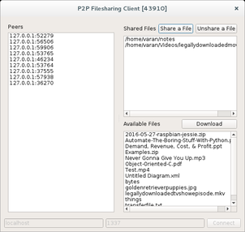

# P2P-File-Transfer-Client

An application that uses peer-to-peer architecture to transfer files among peers on the network. Simply for learning purposes.

 

# Description

As the project's highly imaginative name suggests, P2P File Transfer Client is a desktop application that allows users to share files among one another over a network. Once connected to the network, users may mark a file on their device to be shared. This will allow other nodes to see and download the file.

The application was written in C++. Boost.Asio was used for sockets programming and the GUI was written using Qt Framework. The application is cross-platform.

> It transfers files. So what?

What makes this application unique is that it uses peer-to-peer technology as opposed to the traditional client-server model. This allows the entire network's load to be distributed among the peers on the network. It removes the need for a central server to provide for each node on the network.

> Why do I care about peer-to-peer technology?

Peer-to-peer technology is extremely relevant today, with Bitcoin being a prime example of its various applications. Specifically, Bitcoin's underlying technology, referred to as the "blockchain", is cryptography applied to the peer-to-peer model and is considered to have the potential to disrupt various industries [1].

The financial industry is only one example of this [2,3], with the music industry being another [4]. There are platforms, such as Ethereum, that are being built in an attempt to make the "blockchain" technology more accessible. Ethereum is gaining momentum and is being backed by major corporations [5].

> Okay. Sorry for doubting you.

It's cool.

# Dependencies

[Qt Framework](https://www.qt.io/download/ "Qt Framework") was used to implement the GUI and [Boost.Asio](http://www.boost.org/users/download/ "Boost.Asio") was used for sockets programming. Both are cross-platform and may be downloaded with little to no ease. Especially Boost.

# Installation

- Client: Simply open the `.pro` file in Qt Creator and build for minimum hassle.
- Connection Manager: `g++ -std=c++11 connectionmanager.cpp p2pnode.cpp -o connectionmanager -lboost_system`

# Usage

1. Run the connection manager executable (`./connectionmanager` on Linux).
2. Run the client(s).

