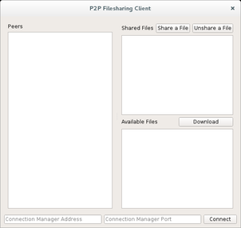

# P2P-File-Transfer-Client

An application that uses peer-to-peer architecture to transfer files among peers on the network. Simply for learning purposes.

 

# Description

As the project's highly imaginative name suggests, P2P File Transfer Client is a desktop application that allows users to share files among one another over a network. Once connected to the network, users may mark a file on their device to be shared. This will allow other nodes to see and download the file.

The application was written in C++. Boost.Asio was used for sockets programming and the GUI was written using Qt Framework. The application is cross-platform.

> It transfers files. So what?

What makes this application unique is that it uses peer-to-peer technology as opposed to the traditional client-server model. This allows the entire network's load to be distributed among the peers on the network. Additionally, if the node that originally hosted the file is down, the file still potentially exists on the network if any other peer downloaded it. The peer-to-peer model removes the need for a central server to provide for each node on the network.

> Why do I care about peer-to-peer technology?

Peer-to-peer technology is extremely relevant today, with Bitcoin being a prime example of its various applications. Specifically, Bitcoin's underlying technology, referred to as the "blockchain", is cryptography applied to the peer-to-peer model and is considered to have the potential to disrupt various industries [1].

The financial industry is only one example of this [2,3], with the music industry being another [4]. There are platforms, such as Ethereum, that are being built in an attempt to make the "blockchain" technology more accessible. Ethereum is gaining momentum and is being backed by major corporations [5].

> Okay. Sorry for doubting you.

It's cool.

# Dependencies

[Qt Framework](https://www.qt.io/download/ "Qt Framework") was used to implement the GUI and [Boost.Asio](http://www.boost.org/users/download/ "Boost.Asio") was used for sockets programming. Both are cross-platform and may be downloaded with little to no ease. Especially Boost.

# Installation

- Client: Simply open the `.pro` file in Qt Creator and build for minimum hassle.
- Connection Manager: `g++ -std=c++11 connectionmanager.cpp p2pnode.cpp -o connectionmanager -lboost_system`

# Usage

1. Run the connection manager executable (`./connectionmanager` on Linux).
2. Run the client(s).

# Further Improvements

1. Effeciency

 Once connected to the network, the application will be able utilize all of its features without a central server. However, the application does not take full advantage of the peer-to-peer model.

 For example: if a specific file is especially popular among the network, much of the load will be concentrated on the single node that originally hosted the file. A solution to this would be to allow clients to share identical files with the network. Peers may now choose from multiple sources to download a particular file, thereby distributing the load. But this is not completely robust either, as the clients still have the choice to choose a particular server. To use up the bandwidth of a particular server, a large group of nodes need only request multiple large files within the same time frame from the same node ([Denial-of-service attack](https://en.wikipedia.org/wiki/Denial-of-service_attack "Denial-of-service attack")).

 To take distribution a step further, instead of downloading an entire file from a single source, clients may download pieces of a particular file from multiple sources, spreading the load effectively. And to ensure that the client requesting the pieces is also contributing to the network, the client may be forced to offer a piece of the file in exchange for a different piece. This way, in order to completely download a file, the client will have to have provided pieces of the file as well. This is, in essence, how the [BitTorrent](https://en.wikipedia.org/wiki/BitTorrent "BitTorrent") protocol works.

2. Security

 Another improvement would be a way to verify data integrity, such as a checksum. The checksum may be appended to each file and verified by the client upon completing a download. Although md5 is considered broken to [collision attacks](https://en.wikipedia.org/wiki/Collision_attack "collision attacks"), it seems that it is still feasible to use as a checksum, so that may be a possibility.

 A more interesting approach to data integrity would be to use a [merkle tree](https://en.wikipedia.org/wiki/Merkle_tree "merkle tree"). This is possible if files are downloaded in pieces by multiple distinct peers instead of being downloaded entirely by a single peer. The idea is that a client will receive the _merkle root_ from either a trusted source or simply multiple sources to reduce the probability of an invalid merkle root. This merkle root would have been calculated by recursively hashing predefined pieces of a file together. Now each time a peer receives the piece of a file, it will also request the file's merkle path. The merkle path would be a the set of hashes necessary to calculate the merkle root of the file the piece is a part of. Now, if the piece has been changed in any way, the merkle root will be different from the one initially retrieved, marking the piece invalid.

 Merkle trees are used in [Bitcoin's blockchain](http://chimera.labs.oreilly.com/books/1234000001802/ch07.html "Bitcoin's blockchain"). The merkle root of the tree of transactions is stored in the header of a block. Now, lightweight nodes that do not download the entire blockchain may request specific transactions from full nodes, and be able to verify the transaction's existence.

